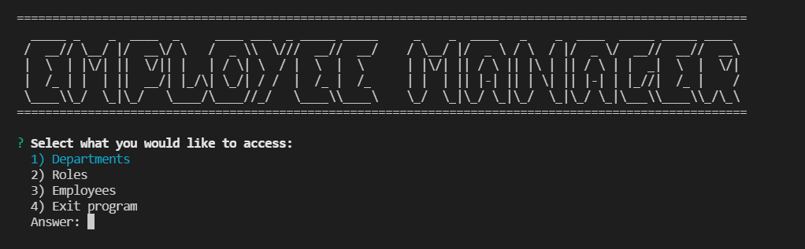
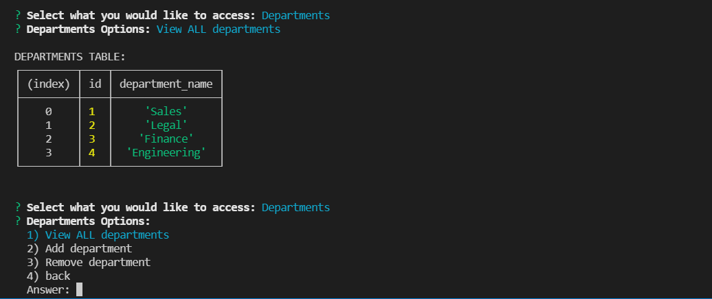
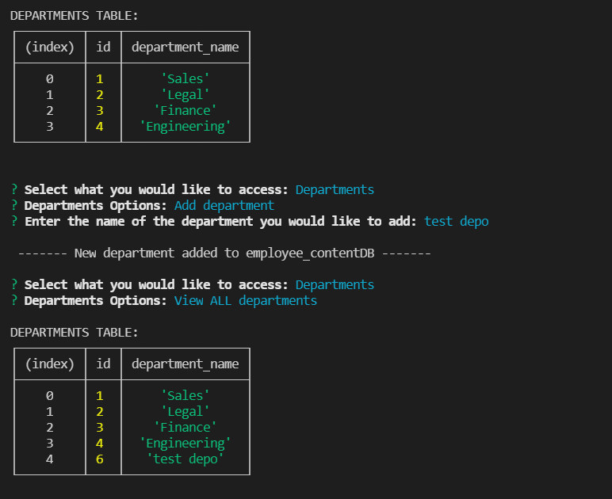
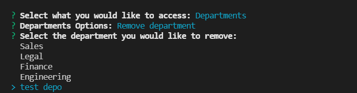
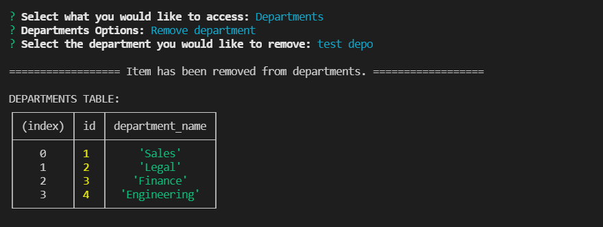
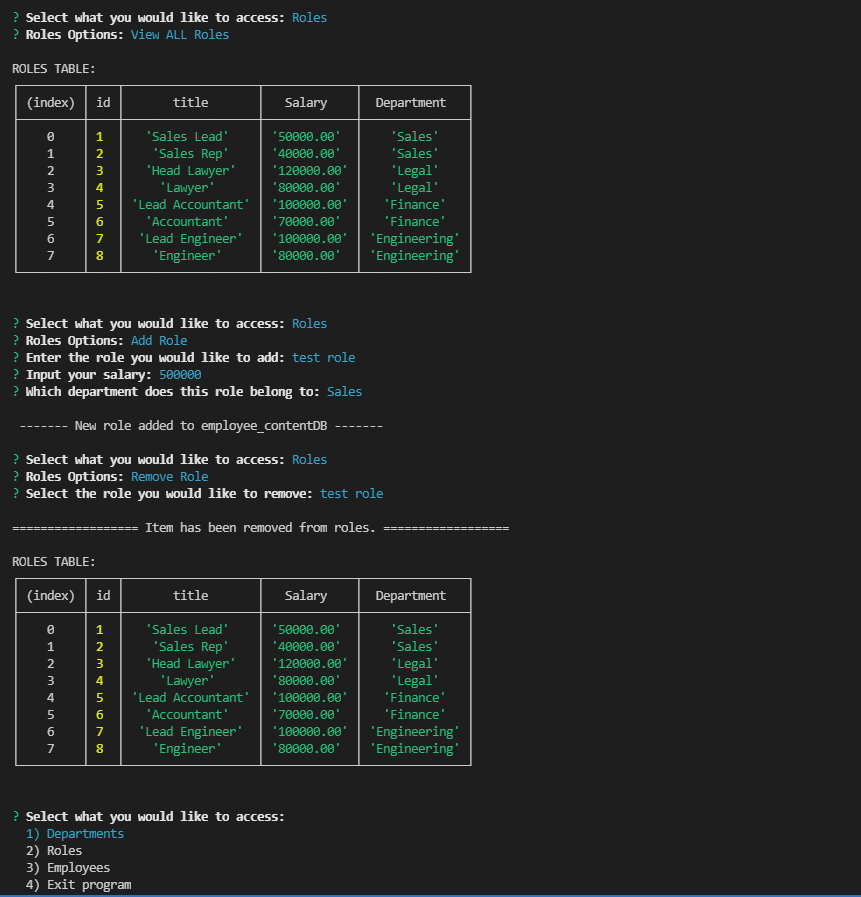
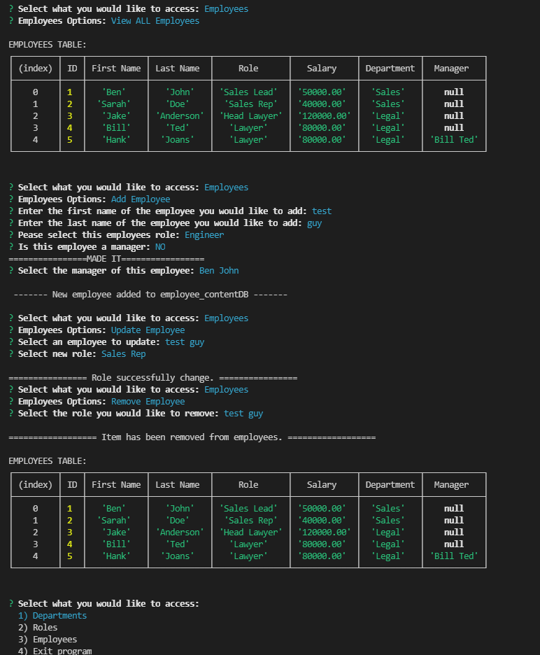

# EMPLOYEE-CONTENT-MANAGEMENT-SYSTEM

Employee tracker (CMS) made with node.js, inquirer and MySQL.

CLI app to interact with a database for managing a Department.

---

<br>

## INSTALLATION

First clone from my repository.

SSH key :

```
git@github.com:Twistedmouse/EMPLOYEE-CONTENT-MANAGEMENT-SYSTEM.git
```

Next you will need to npm install the dependencies:

`npm install`

Also don't forget to add your credentials in the `.env.EXAMPLE` and rename it to `.env`
Be sure to seed your database as well. `./db/seed.sql`

---

<br>

## USAGE

Run `npm start` to begin and follow the prompts to make a selection on what you would like to do.

---

<br>

## WALKTHROUGH

### Video walkthrough:

<a href="https://drive.google.com/file/d/1G9FC-VyTtIXoxE0dK6uLWwV529kKW4sU/view?usp=sharing" rel="nofollow"></a>

### Screenshots:
















## Technologies:

- <a href="https://nodejs.org/en/docs/" rel="nofollow">Node.js</a>
- <a href="https://www.npmjs.com/package/inquirer" rel="nofollow">Inquirer</a>
- <a href="https://www.npmjs.com/package/mysql" rel="nofollow">mySQL</a>
- JavaScript
- CSS

---

## Questions:

<p>If you have any questions, head to my <a href="https://github.com/Twistedmouse">GitHub</a> or send me an <a href="mailto:mousy93@hotmail.com">email</a>.</p>
